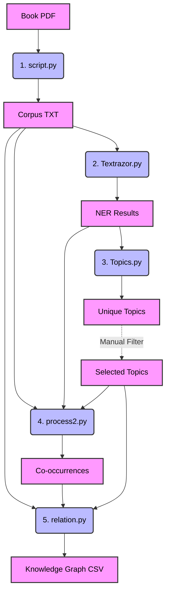

# **Knowledge Graph Extraction Pipeline**
### High-Level Overview

This presentation explains the end-to-end NLP pipeline designed to extract a **Weighted Knowledge Graph** from raw PDF books. 

**Goal:** Transform unstructured text into structural subject-relation-object graphs using NLP & LLMs.
**Key Technologies:** PyMuPDF, TextRazor API, Ollama (Llama 3)
***
# **Architecture Flowchart**
### How data flows through the pipeline

*Note: `pipeline.py` orchestrates this entire sequence automatically!*
***
# **1. The Orchestrator (`pipeline.py`)**

`pipeline.py` serves as the **master controller** for the entire process. 

Instead of running each script manually, this script:
1. Takes a `--book` argument (e.g., `1910.pdf`).
2. Creates an organized, timestamped `Results` directory for the run.
3. Automatically executes each sub-script in the correct order (`script.py` → `Textrazor.py` → `Topics.py` → `process2.py` → `relation.py`).
4. Passes the correct input/output file paths between the sequential steps.
***
# **2. Data Ingestion (`script.py`)**

**Goal:** Convert raw PDF books into machine-readable plain text.

* **Tooling:** Uses `fitz` (PyMuPDF) library.
* **Process:** Iterates through every page in the PDF document and extracts the text layer into a flat string.
* **Output:** A single `.txt` file containing the entire book's text, saved to the `corpus` directory. It uses simple paragraph spacing to maintain boundaries.
***
# **3. NER & Entity Extraction (`Textrazor.py`)**

**Goal:** Extract Named Entities and thematic Topics using cloud AI.

* **Tooling:** TextRazor API.
* **Process:** 
  1. Chunks the entire text corpus into manageable ~190KB blocks to avoid API limits.
  2. Sends blocks to TextRazor for Deep NER and Topic categorization.
  3. Groups the discovered entities by their Freebase Category (e.g., "Person", "Location") and logs relevance/confidence scores.
* **Output:** `ner_results.txt`, containing hierarchical groups of identified entities and text topics.
***
# **4. Topic Aggregation (`Topics.py`)**

**Goal:** Deduplicate and consolidate the unique topics found across the document.

* **Tooling:** Regular Expressions (Regex).
* **Process:** Scans the newly generated `ner_results.txt` for topics (annotated with paths like `/Society/...`). It extracts these, deduplicates them, and sorts them alphabetically. 
* **Output:** `unique_topics.txt` which lists every unique theme in the text.
* **Human-in-the-loop:** A user typically drops unwanted topics and saves a filtered list to `Selected_Topics.txt` before continuing.
***
# **5. Co-occurrence Analysis (`process2.py`)**

**Goal:** Find which selected entities physically appear near each other in the text.

* **Process:** 
  1. Identifies "Anchor Entities" based on the user's `Selected_Topics.txt`.
  2. Scans the raw corpus text to find instances of these anchors.
  3. Creates a sliding window (±50 words) around the anchor.
  4. Records what *other* recognized entities appear in that same window, incrementing a co-occurrence counter.
* **Output:** `entity_cooccurrences.txt` – a map of "Anchor Entities", the other entities near them, counts, and a text snippet of the context.
***
# **6. Relation Extraction (`relation.py`)**

**Goal:** Convert co-occurring entity pairs into exact Subject-Relation-Object triples.

* **Tooling:** Ollama (`llama3` model) – Local LLM.
* **Process:**
  1. Reads the pairs from the co-occurrence output.
  2. Finds the exact sentences in the corpus where these pairs appear.
  3. Passes these small sentence chunks to Llama 3 with strict prompt instructions to output valid JSON Triples (e.g., `{"subject": "X", "relation": "TAXATION", "object": "Y"}`).
  4. Aggregates and weights the triples by frequency.
* **Final Output:** `weighted_knowledge_graph.csv` containing the fully structured knowledge graph!
